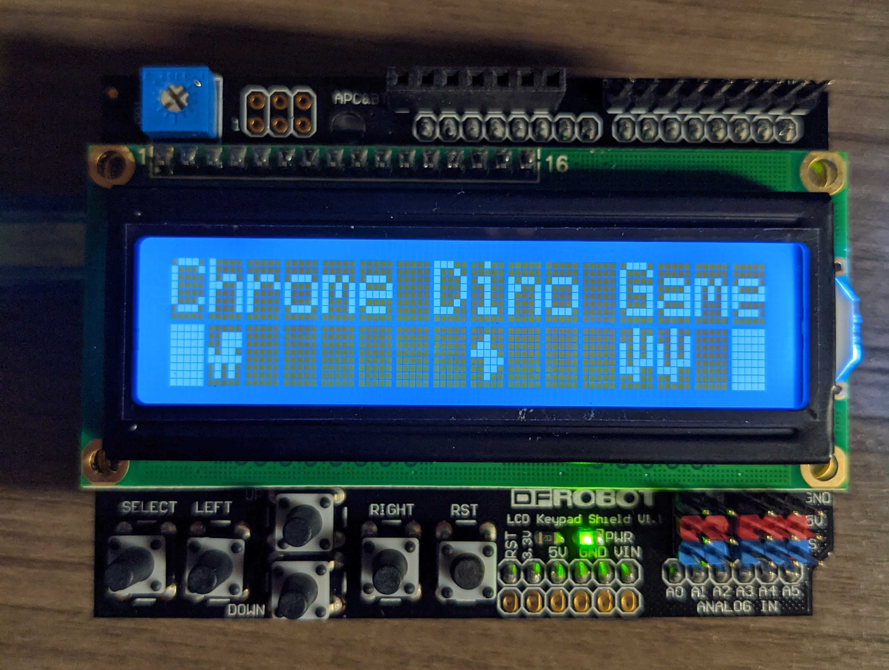

# Screenshot of Start Screen

# Gameplay

# Features
* Splash screen that waits until you are ready.
* When you are holding the SELECT button to jump, score is stopped from incrementing so that you can't just hold down the button the entire time.
* Custom characters for the dinosaur, cacti, birds, and blocks.
* Death screen.
* High score saved in internal EEPROM.
* Ability to erase high score using "secret" code. (You can read the code and figure out the code!)

# How to Play
* Press SELECT to start.
* Pres SELECT to jump.
* When you die, reset using the RESET button.
* Repeat until you are sick of it.
* To erase high score, click DOWN when you are at the splash screen. Then increment/decrement the code using the UP and DOWN buttons respectively to change the code. Default code   is 123. Press SELECT to enter. Hi score should be erased.

# How the Code Works
* First, I include all of the necessary libraries and the bitmaps. Then, I define an object called lcd. I define a bunch of variables and #defines. Then I write an array as a     buffer for holding what goes on the screen. Then I define more variables.

* Then setup starts. I do all of the necessary stuff, like creating the characters and showing the splash screen.

* We have loop next. I define some timing variables, like in blinkwithoutdelay. I do the check if the time has passed long enough. Then, I use the random function to decide when   and what to put in the buffer. After that, I shift all of the elements in the buffer down one using a for loop. Then it checks whether to add the score or not because as I       said earlier, when you are jumping you cannot get any points.

* Then I draw the barriers next, as you see the blocks bitmap.

* Then I check whether the SELECT (jump) button is pressed. It then modifies the buffer to show whether the dinosaur is jumping or not.

* The next code checks whether dinosaur has been airborne long enough so that the dinosaur can come down.

* This is where the code checks whether there is an obstacle in the way.

* If the dinosaur didn't crash, then the Arduino updates the lcd and prints the score. Else, it shows the death screen.

* Then the final code is not required-it blinks the LED. If you are having problems with timing, then you could remove/comment the blink code out.

* Last, the Arduino build process includes the Functions tab at the end of the sketch for us. This includes lots of functions that are used throughout the code.
